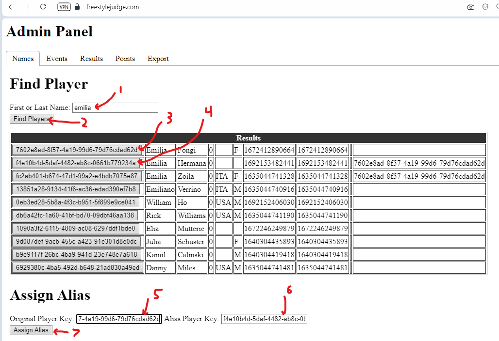
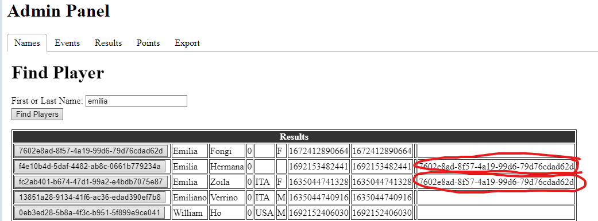
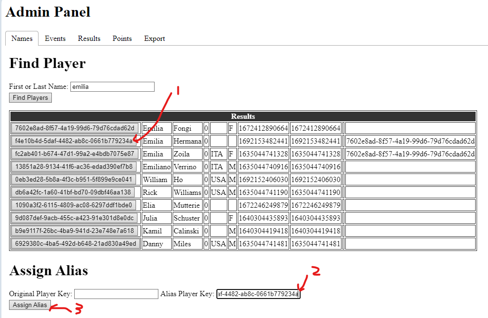
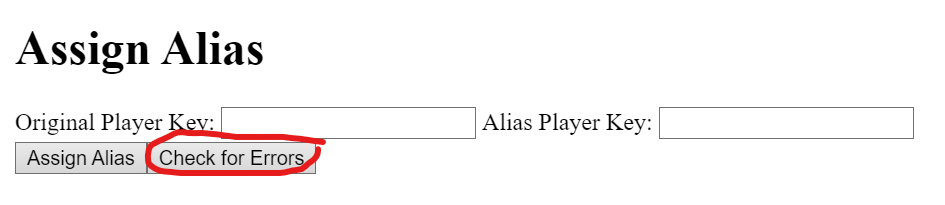
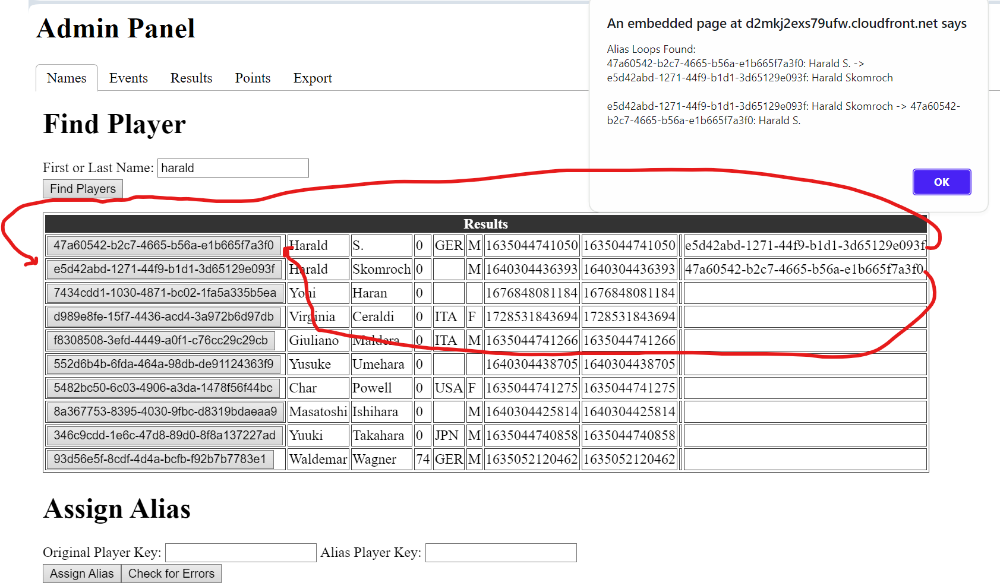

# player-name-server

This is a microservice that manages data associated with players. ie. Name, Country, Gender, FPA Membership Number

Example **getAllPlayers** call in [jsbin](https://jsbin.com/qakiduqaji/edit?js,console)

## Interface
### getAllPlayers
GET. Returns a JSON object containing all known players.  
URL: https://tkhmiv70u9.execute-api.us-west-2.amazonaws.com/development/getAllPlayers

Return:
{
    players: allPlayerData
}

The allPlayerData schema
| Property    | Type | Description |
| --- | --- | --- |
| Key | string | GUID shared across all microservices |
| firstName | string | First Name |
| lastName | string | Last Name |
| createdAt | number | Time in MS when this entry was created |
| lastActive | number | Time in MS when this entry last modified |
| membership | number | FPA Membership Number |
| country | string | 3 letter country abbreviation |
| gender | string | M, F, X |
| aliasKey | string | GUID shared across all microservices |

### removePlayer
POST. Removes a player  
URL: https://tkhmiv70u9.execute-api.us-west-2.amazonaws.com/development/removePlayer/{key}  
key: The GUID key of the player to remove

### modifyPlayer
POST. Modify a player's data by key  
URL: https://tkhmiv70u9.execute-api.us-west-2.amazonaws.com/development/modifyPlayer/{key}/firstName/{firstName}/lastName/{lastName}  
key: The GUID key of the player to modify  
firstName: First Name  
lastName: Last Name  
body: Optional. JSON string containing optional fields:
| Property    | Type | Description |
| --- | --- | --- |
| membership | number | FPA Membership Number |
| country | string | 3 letter country abbreviation |
| gender | string | M, F, X |

## Implementation
Data is stored in DynamoDB and cached in S3. Aws Lambda handles all the requests, queries the data, and return the result.

There are 2 DynamoDB tables. An Info table that store whether the S3 cache needs to be updated and a Player table. The Player table has a row for each player. The Key is a GUID, and the data are all the properties for the player.

When **getAllPlayers** is called, a scan of the Player table is done, then the results are cached in S3. If **removePlayer** or **modifyPlayer** is called, the cache is marked as dirty and the next **getAllPlayers** will scan the Player table and cache the results again.

## Troubleshooting
### Combining player entries.
If a person has multiple entries, you can combine them using Assign Alias.
  
1. Enter partial name to find entries
2. Click Find Players to show all matching results
3. Find Original Player in search results. This is the name that will show in the published rankings. Clicking the button will copy the Key to the clipboard
4. Find the Alias Player in search results. This entry will be combined with the Original Player. Clicking the button will copy the Key to the clipboard
5. Enter the Original Player Key. Click the button from step 3 with the Key and paste it into the textbox
6. Enter the Alias Player Key. Click the button from step 4 with the Key and paste it into the textbox
7. Click Assign Alias

You can confirm by clicking Find Players again and seeing the Alias Key filled in. In Emilia's case, she has 3 entries, so 2 are marked as aliases

### Removing Alias
If you need to remove an alias from an entry, assign a blank Original Key to an Alias

1. Find the Alias Player. This entry will become detached from the Original Player. Clicking the button will copy the Key to the clipboard
2. Enter the Alias Key into the Alias Player Key textbox.
3. Click Assign Alias

## Dealing with Alias Loops
There cannot be a loop of alias. This will cause the Points tab to hang when generating points. Use the Check For Errors button to detect loops

### Loop Example
The 2 Harald entries point to each other. This means the system doesn't know which one to use. There should be an entry that doesn't point to anything. The entry that doesn't have an alias is the one that shows in the rankings.
